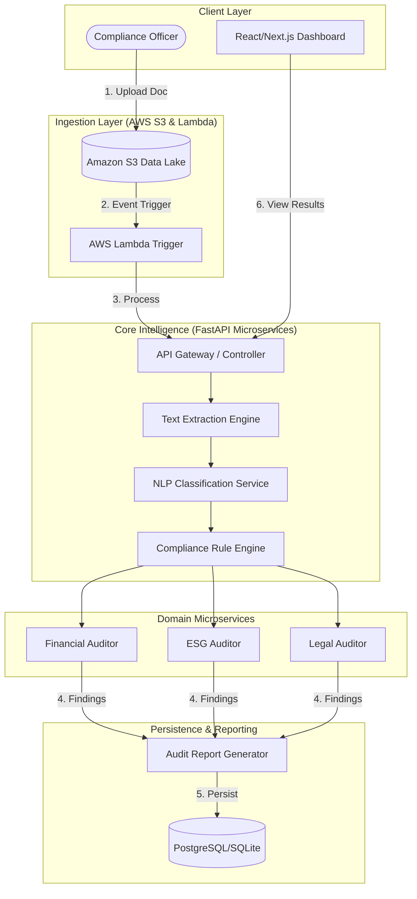

# Cloud-Native Automated Compliance and Audit System (CACA)

**Category:** Enterprise Software Engineering & Applied Artificial Intelligence  
**Project Type:** College Final Year Capstone Project  
**Status:** Functional Prototype (MVP)

---

## 1. Abstract

The **Cloud-Native Automated Compliance and Audit System (CACA)** is an AI-driven platform designed to automate the labor-intensive process of auditing corporate documents. By leveraging Natural Language Processing (NLP) and an event-driven cloud architecture, the system identifies regulatory risks, financial inconsistencies, and ESG (Environmental, Social, and Governance) gaps in real-time. This project demonstrates a scalable approach to "RegTech" (Regulatory Technology) by transforming unstructured data into actionable compliance intelligence.

## 2. Problem Statement

Enterprises spend millions of dollars annually on manual document auditing to ensure compliance with legal, financial, and sustainability standards. Manual audits are:

- **Error-Prone**: Human auditors can overlook critical clauses in 500+ page documents.
- **Inconsistent**: Different auditors may interpret risks differently.
- **Slow**: Processing a single corporate report can take days, delaying critical business decisions.

## 3. The Solution

CACA provides a centralized, automated pipeline for document auditing:

1. **Automated Ingestion**: Documents are uploaded to a secure cloud data lake (Amazon S3).
2. **Multi-Stage Processing**: An event-driven Lambda trigger routes text to specialized NLP microservices.
3. **Risk Intelligence**: The system analyzes text against Finance, ESG, and Legal rule-sets to flag anomalies.
4. **Explainable Reporting**: Every finding is backed by "Evidence Excerpts," ensuring transparency for human auditors.

---

## 4. System Architecture



---

## 5. Technical Implementation Details

### **A. Natural Language Processing (NLP)**

- **Rule-Based Extraction**: Uses complex Regex and keyword density analysis to categorize documents and identify standard clauses.
- **Entity Recognition**: Automatically identifies Organizations, Dates, and Monetary values to correlate financial data.
- **Classification Engine**: Routes documents to specialized domain-specific auditors (Financial vs. Legal) based on content analysis.

### **B. Backend Microservices**

- **FastAPI**: Used for high-performance, asynchronous API endpoints.
- **SQLAlchemy (ORM)**: Manages a relational schema tracking Audit Documents, Findings, and Summary Reports.
- **Risk Scoring Algorithm**: A weighted scoring engine that computes a 0-10 Risk Score based on the severity (Critical/High/Medium/Low) of detected violations.

### **C. Frontend Dashboard**

- **Next.js & Tailwind CSS**: A modern, responsive interface designed for Compliance Officers.
- **Audit Traceability**: Allows users to "click-to-view" the exact evidence in the source document where a risk was found.

---

## 6. Future Work & Scalability

- **LLM Integration**: Replacing Regex-based rules with Large Language Models (e.g., GPT-4 or Claude via Amazon Bedrock) for deeper semantic understanding.
- **OCR (Optical Character Recognition)**: Integrating Amazon Textract to process scanned PDFs and handwritten notes.
- **Real-time Alerting**: Integrating AWS SNS (Simple Notification Service) to send Slack or Email alerts for 'Critical' compliance failures.
- **Blockchain for Immutability**: Storing the audit hash on a private ledger to ensure audit trails cannot be tampered with.

---

## 7. Getting Started

### Prerequisites

- Python 3.14+
- Node.js & NPM

### Local Setup

1. **Clone the Repo**
2. **Install Backend Dependencies**:
   ```bash
   pip install -r backend/requirements.txt
   ```
3. **Run the Platform**:
   ```bash
   ./run_platform.sh
   ```
4. **Access Dashboard**: Open `http://localhost:3000` (after running `npm run dev` in `frontend/`)
