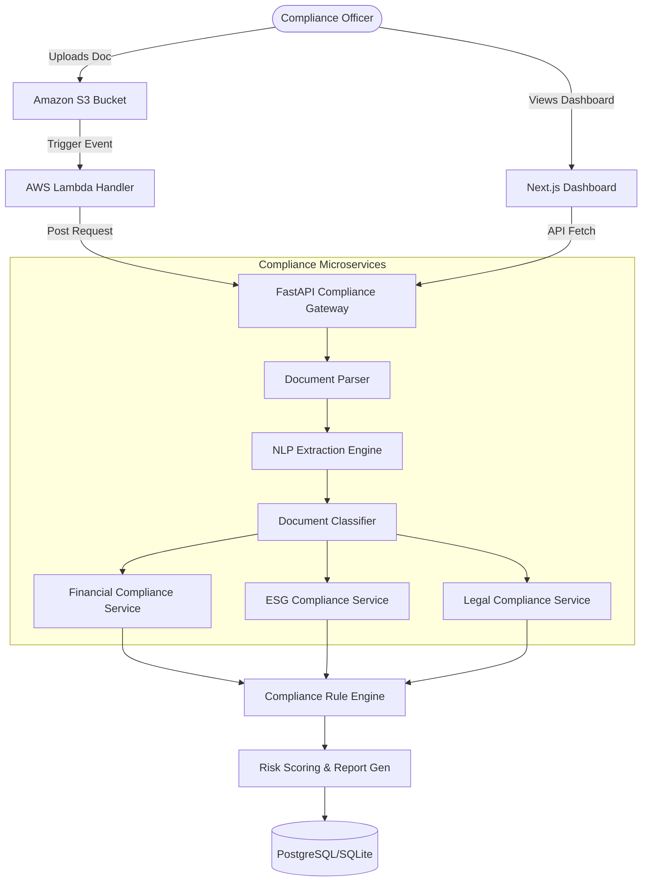

# Cloud-Native Automated Compliance and Audit System

## Overview

An enterprise-grade, cloud-native AI platform designed to automatically analyze corporate documents (financial reports, legal contracts, ESG disclosures) to identify compliance risks, missing data, and inconsistencies.

The system utilizes specialized NLP microservices and a serverless event-driven architecture to transform raw document uploads into structured, explainable audit reports.

---

## Architecture

---

## Key Features

- **Intelligent Extraction**: Automated PDF/Text processing with entity and clause identification.
- **Microservice Compliance Engines**:
  - **Financial**: Revenue recognition, debt-to-equity anomalies, audited statement verification.
  - **ESG**: Greenwashing detection, carbon footprint disclosure validation.
  - **Legal**: Jurisdiction analysis, liability cap identification, regulatory clause checking.
- **Explainable Audits**: Risk findings are linked directly to evidence (excerpts) within the source document.
- **Serverless Workflow**: Event-driven processing triggered on S3 uploads for massive scalability.

---

## Project Structure

- `backend/`: FastAPI application containing specialized compliance services.
  - `services/`: Core logic for NLP, Risk Scoring, and Compliance checks.
- `serverless/`: AWS Lambda handlers and infrastructure-as-code templates.
- `frontend/`: React/Next.js dashboard for real-time audit visibility.
- `samples/`: Example corporate reports for testing and demonstration.
- `run_platform.sh`: One-click startup script for the local environment.

---

## Technology Stack

- **Languages**: Python, JavaScript
- **Backend Framework**: FastAPI, Pydantic, SQLAlchemy
- **NLP/ML**: NLTK, Spacy/Scikit-learn, Regex-based Clause Matching
- **Frontend**: Next.js, React, Tailwind CSS, Lucide Icons
- **Cloud (Mocked/Compatible)**: AWS S3, AWS Lambda, API Gateway
- **Database**: SQLite (Local Dev) / PostgreSQL (Production)
